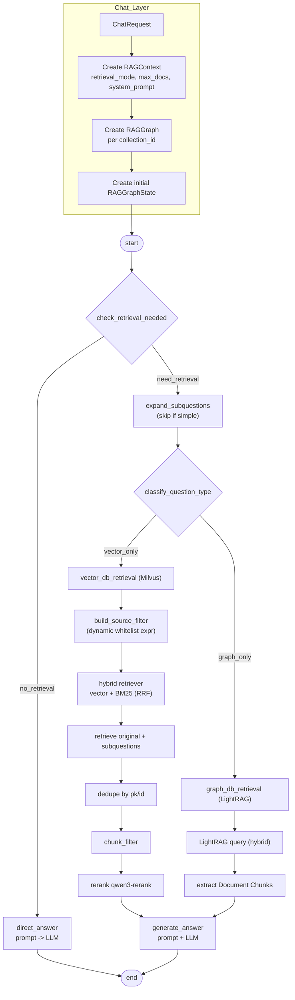

```mermaid
flowchart TD
  subgraph Chat_Layer
    A[ChatRequest] --> B[Create RAGContext\nretrieval_mode, max_docs, system_prompt]
    B --> C[Create RAGGraph\nper collection_id]
    C --> D[Create initial RAGGraphState]
  end

  D --> start([start])
  start --> check{check_retrieval_needed}

  check -- no_retrieval --> direct["direct_answer\nprompt -> LLM"] --> EndNode([end])

  check -- need_retrieval --> expand["expand_subquestions\n(skip if simple)"]
  expand --> classify{classify_question_type}

  classify -- vector_only --> vdb["vector_db_retrieval (Milvus)"]
  classify -- graph_only --> gdb["graph_db_retrieval (LightRAG)"]

  vdb --> v1["build_source_filter\n(dynamic whitelist expr)"]
  v1 --> v2["hybrid retriever\nvector + BM25 (RRF)"]
  v2 --> v3[retrieve original + subquestions]
  v3 --> v4[dedupe by pk/id]
  v4 --> v5[chunk_filter]
  v5 --> v6[rerank qwen3-rerank]
  v6 --> gen["generate_answer\nprompt + LLM"]

  gdb --> g1["LightRAG query (hybrid)"]
  g1 --> g2[extract Document Chunks]
  g2 --> gen

  gen --> EndNode
```